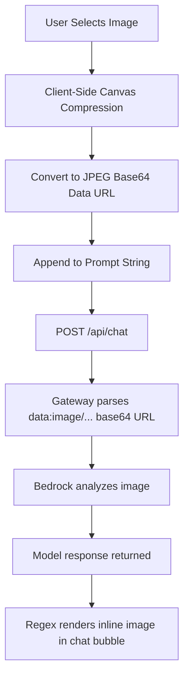
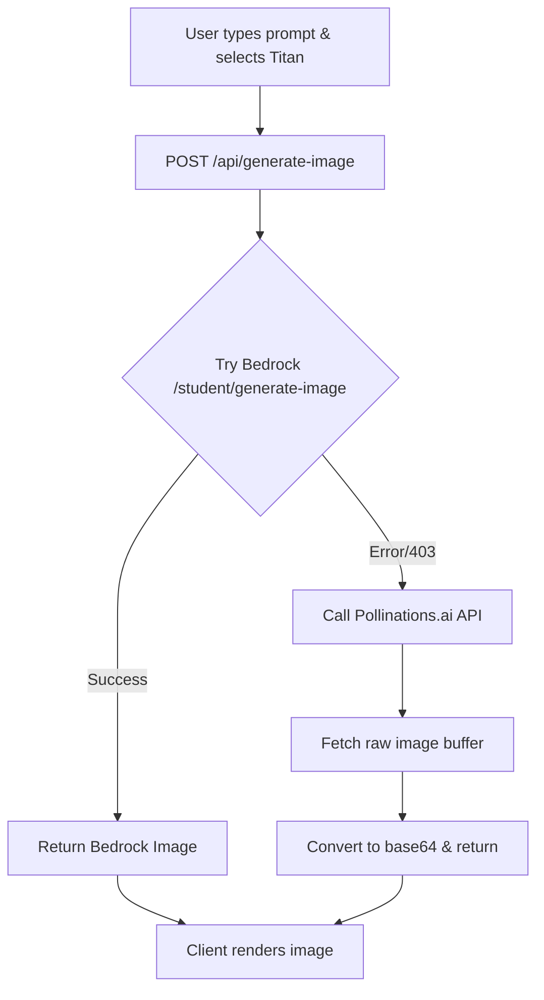

# Multimodal Integration Guide: Vision & Image Generation

This guide explains how **Vision (Image Input)** and **Image Generation (Text-to-Image / Image-to-Image)** are integrated into the Bedrock Portal.

---

## 1. Vision Integration (Image-to-Text Analysis)

Vision is supported using the **Qwen 3 VL (Vision)** model (`qwen.qwen3-vl-235b-a22b`). Since the Student Bedrock Gateway strictly requires message content to be a `string` (rejecting standard multi-part JSON block arrays), we use an **inline serialization workflow**.



### Step A: Client-Side Upload & Canvas Compression
When a user uploads an image, large payloads (e.g. >200kb raw screenshots) can cause the gateway to crash with a `500 Internal Server Error` due to catastrophic backtracking in Python's regex parser. 
To solve this, the browser dynamically compresses the image using an HTML5 Canvas down to a maximum of **1000x1000 pixels at 85% quality** in `public/app.js`:

```javascript
function compressImage(file, maxWidth, maxHeight, quality) {
  return new Promise((resolve, reject) => {
    const reader = new FileReader();
    reader.onload = (e) => {
      const img = new Image();
      img.onload = () => {
        let width = img.width;
        let height = img.height;
        
        // Scale proportionally
        if (width > height) {
          if (width > maxWidth) {
            height = Math.round((height * maxWidth) / width);
            width = maxWidth;
          }
        } else {
          if (height > maxHeight) {
            width = Math.round((width * maxHeight) / height);
            height = maxHeight;
          }
        }
        
        const canvas = document.createElement('canvas');
        canvas.width = width;
        canvas.height = height;
        
        const ctx = canvas.getContext('2d');
        // Fill canvas with white background to handle transparent PNGs correctly
        ctx.fillStyle = '#ffffff';
        ctx.fillRect(0, 0, width, height);
        ctx.drawImage(img, 0, 0, width, height);
        
        resolve(canvas.toDataURL('image/jpeg', quality));
      };
      img.onerror = (err) => reject(err);
      img.src = e.target.result;
    };
    reader.onerror = (err) => reject(err);
    reader.readAsDataURL(file);
  });
}
```

### Step B: Inline Prompt Serialization
The compressed JPEG base64 Data URL is appended directly to the end of the text prompt, separating it with double newlines:

```javascript
let fullMessageText = text;
if (attachedFile) {
  fullMessageText = `${text}\n\n${attachedFile.base64}`;
}
```
This single string is saved to the SQLite database and sent to the server's `/api/chat` route, which forwards it to the gateway.

### Step C: Gateway Parsing & Model Response
The Student Bedrock Gateway interceptor parses the message content string. It detects the `data:image/jpeg;base64,...` prefix, converts the base64 string back into binary bytes, and maps it to a standard Bedrock Converse API **Image Block** before executing the model invocation.

### Step D: Render Image in Chat Bubbles
When the message is rendered in the chat window, a Markdown parser formats the text. We run a regex replacer in `public/app.js` to render the base64 string as a viewable image:

```javascript
html = html.replace(/data:image\/([a-zA-Z+]*);base64,([A-Za-z0-9+/=]+)/g, match =>
  `<div class="chat-media-preview"></div>`
);
```

---

## 2. Image Generation (Text-to-Image / Image-to-Image)

Image Generation is supported using the **Titan Image Generator v2** model (`amazon.titan-image-generator-v2:0`). If the user does not have permission or has region limits on their Bedrock key, the backend automatically falls back to **Pollinations.ai** (a free, unauthenticated Stable Diffusion service).



### Step A: API Route `/api/generate-image`
The backend route in `src/server.js` coordinates the request:

```javascript
app.post('/api/generate-image', async (req, res) => {
  const { prompt, modelName, inputImage, width, height } = req.body;
  if (!prompt) return res.status(400).json({ error: 'Missing prompt' });

  const model = modelName || 'amazon.titan-image-generator-v2:0';
  const w = width || 512;
  const h = height || 512;

  // 1. Try Bedrock First
  try {
    const data = await callImageGeneration(prompt, model, inputImage, w, h);
    return res.json(data);
  } catch (bedrockErr) {
    console.log(`Bedrock image gen failed (${bedrockErr.message}), falling back to Pollinations`);
  }

  // 2. Fallback to Pollinations.ai
  try {
    const data = await callPollinationsImageGen(prompt, w, h);
    return res.json(data);
  } catch (pollinationsErr) {
    console.error("All image gen failed:", pollinationsErr);
    return res.status(500).json({ error: 'Image generation failed.' });
  }
});
```

### Step B: Bedrock Gateway Request
Calls the `/student/generate-image` endpoint on the gateway. If an `inputImage` is provided, it operates in **Image-to-Image** mode:

```javascript
async function callImageGeneration(prompt, modelName, inputImageBase64, width, height) {
  const payload = {
    model_id: modelName,
    prompt,
    width: width || 512,
    height: height || 512,
    num_images: 1
  };
  if (inputImageBase64) payload.input_image = inputImageBase64;

  const response = await fetch(`${base_url}/student/generate-image`, {
    method: 'POST',
    headers: {
      "Authorization": `Bearer ${process.env.SBG_API_KEY}`,
      "Content-Type": "application/json"
    },
    body: JSON.stringify(payload)
  });

  if (!response.ok) {
    throw new Error(`Gateway returned status ${response.status}`);
  }
  return await response.json();
}
```

### Step C: Pollinations.ai Fallback
Fetches a dynamically generated image and converts the raw image buffer to a base64 string on the backend:

```javascript
async function callPollinationsImageGen(prompt, width, height) {
  const seed = Math.floor(Math.random() * 999999);
  const url = `https://image.pollinations.ai/prompt/${encodeURIComponent(prompt)}?width=${width}&height=${height}&nologo=true&seed=${seed}`;
  
  const response = await fetch(url, { signal: AbortSignal.timeout(30000) });
  if (!response.ok) throw new Error(`Pollinations returned ${response.status}`);
  
  const arrayBuffer = await response.arrayBuffer();
  const base64 = Buffer.from(arrayBuffer).toString('base64');
  return { images: [`data:image/jpeg;base64,${base64}`], source: 'pollinations.ai' };
}
```

---

## 3. Sidebar UI Integration

The model dropdown switch triggers UI layout updates dynamically inside `public/app.js`:

```javascript
modelSelect.addEventListener('change', () => {
  const selectedModel = modelSelect.value;
  const isImageGen = selectedModel === 'amazon.titan-image-generator-v2:0';
  
  if (isImageGen) {
    // Show image size picker and adjust textarea placeholder
    imageSizeWrapper.style.display = 'block';
    userInput.placeholder = "Describe the image you want to generate...";
  } else {
    // Hide image size picker and reset placeholder
    imageSizeWrapper.style.display = 'none';
    userInput.placeholder = "Message Bedrock...";
  }
});
```
This changes the text field context, telling the user whether their input prompt will result in a **Chat Completion** or an **Image Generation** request.
